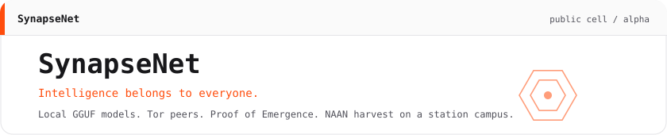
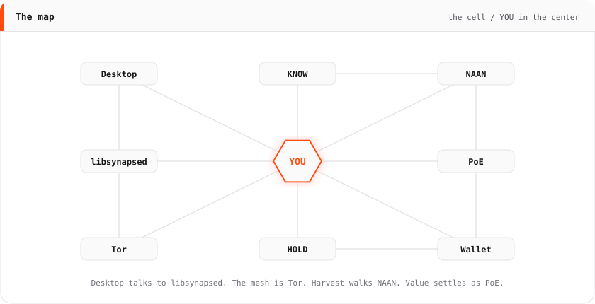
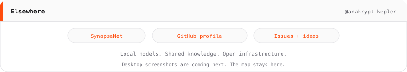

<p align="center">
  <picture>
    <source media="(prefers-color-scheme: dark)" srcset="pictures/art/hero-dark.svg">
    
  </picture>
</p>
<p align="center">
  <picture>
    <source media="(prefers-color-scheme: dark)" srcset="pictures/art/tiles-dark.svg">
    
  </picture>
</p>
<p align="center">
  <picture>
    <source media="(prefers-color-scheme: dark)" srcset="pictures/art/map-dark.svg">
    
  </picture>
</p>
<p align="center">
  <picture>
    <source media="(prefers-color-scheme: dark)" srcset="pictures/art/portrait-dark.svg">
    
  </picture>
</p>
<p align="center">
  <picture>
    <source media="(prefers-color-scheme: dark)" srcset="pictures/art/footer-dark.svg">
    
  </picture>
</p>
<p align="center">
  <a href="https://github.com/anakrypt-kepler">GitHub</a>
  ·
  <a href="https://github.com/anakrypt-kepler/anakrypt-kepler">Profile</a>
  ·
  <a href="https://github.com/anakrypt-kepler/Synapsenetai/issues">Issues</a>
</p>

<p align="center"><small>Fuck the corps.</small></p>

<p align="center">
  <em>"Satoshi gave us money without banks. I will give you brains without corporations."</em> — Kepler
</p>

<p align="center">
  
  <a href="LICENSE"></a>
  
</p>

---

Desktop screenshots come next. The map stays here.

I built this. One person. C++, crypto, Tor, a local model. Not a company. Not a committee.

SynapseNet is a **decentralized intelligence network**. Bitcoin is to money what this is to knowledge: you mine useful contribution, not hashes. Your machine runs a GGUF. Peers talk over Tor hidden services. **Proof of Emergence** is the ledger that accepts knowledge — an LLM does not judge consensus. **NGT** is the unit on that ledger. **NAAN** is the miner: a local agent that grows the shared knowledge body while you sleep.

The front door is this repo: [github.com/anakrypt-kepler/Synapsenetai](https://github.com/anakrypt-kepler/Synapsenetai).

The mesh is already live. Two cells are talking over Tor. The bootstrap seed (always-on cell) is in `synapsenet.conf.example` as `network.seed_nodes=`. First install copies that file to `~/.synapsenet/synapsenet.conf`. I do not bake seed onions into the binary — rotate the seed by editing the example, not by shipping a new `.so`.

A full cell is peer + miner + validator. PoE is votes, not a roll call of every onion. Each full cell casts its own vote over the mesh (`POE_ENTRY` / `POE_VOTE`). Recipes travel as `POE_RECIPE` / `POE_RECIPE_REPLAY`. Two full cells: both must vote, then it finalizes. When the set grows, the threshold is a strict majority (2 of 3, 3 of 5, …). A thin mailbox with no `poe_pk` stays mail — it does not judge.

This is alpha. Expect bugs. Read the holes before you trust the skin.

```
                    you
                    │
                    ▼
        ┌──────────────────────────────────────┐
        │         synapsenet-app Tauri         │
        │  MAIN WALLET SEND BLOCKS KNOW NAAN   │
        │  HARVEST INTEL MSG IDE NET RENT SET  │
        └──────────────────┬───────────────────┘
                           │ JSON RPC same process
                           ▼
        ┌──────────────────────────────────────────────────────────┐
        │                    libsynapsed.so                        │
        │                                                          │
        │   session Tor          PoE v1            Transfer        │
        │   ADD_ONION NEW        poe.db            wallet.dat      │
        │   DiscardPK            entries votes     stealth SEND    │
        │   ephemeral v3         finalize          RingCT coinbase │
        │                                                          │
        │   NAAN harvest         GGUF mouth        MSG sealed      │
        │   lymph then recipe    not the judge     NET map YOU     │
        │   scar of a door       two clocks        seniority ring  │
        └────────┬───────────────────┬──────────────────┬──────────┘
                 │                   │                  │
                 │ SOCKS             │ POE_ENTRY        │ stealth tx
                 │                   │ POE_VOTE         │
                 │                   │ POE_RECIPE       │
                 │                   │ POE_RECIPE_REPLAY│
                 ▼                   ▼                  ▼
        ┌──────────────────────────────────────────────────────────┐
        │                      Tor mesh                            │
        │              onion :8333   fail closed                   │
        │         seed only from synapsenet.conf                   │
        └────────────┬─────────────────────┬───────────────────────┘
                     │                     │
          ┌──────────┘                     └──────────┐
          ▼                                           ▼
 ┌─────────────────────┐                   ┌─────────────────────┐
 │  desktop cell       │                   │  VPS mesh-peer.py   │
 │  poe_pk             │◄──── PEX onions ─►│  stable onion       │
 │  miner + validator  │                   │  mailbox            │
 │  NAAN               │                   │  synapsed-poe-mesh  │
 │  stealth wallet     │                   │  votes if poe_pk    │
 └──────────┬──────────┘                   │  no stealth NGT     │
            │                              └──────────┬──────────┘
            │                                         │
            └──────────── 2 of 2 / majority ──────────┘


 ~/.synapsenet
    synapsenet.conf
    wallet.dat
    wallet.key          PoE key
    poe/poe.db
    lib/libsynapsed.so
    models/*.gguf


 knowledge

    IDE CODE / TEXT                    NAAN / harvest
            │                                │
            │  title + body                  ▼
            │  PoW 12  ≤ 64 KiB         lymph (same machine)
            ▼                                │
       POE_ENTRY                             ├─ hash mismatch  die here
            │                                └─ hash match
            │                                      │
            │                                      ▼
            │                              RECIPE  locator + selector + body hash
            │                              page bytes never leave
            │                                      │
            │                                      ▼
            │                              POE_RECIPE
            │                              POE_RECIPE_REPLAY
            │                                      │
            └──────────────────┬───────────────────┘
                               │
                               ▼
                          mouth isolation
                          GGUF / prompt / score from model
                          cannot vote or finalize
                               │
                               ▼
                          POE_VOTE
                               │
                               ▼
                          two clocks
                          cite DAG orders recipes
                          Tor arrival time does not vote
                               │
                               ▼
                          FINALIZED
                               │
            ┌──────────────────┼──────────────────┐
            ▼                  ▼                  ▼
          KNOW              RingCT             scar
          author            coinbase           gate class
          amount            0.10 stealth       UTC day
          rewardId          unique submitId    method class
          public            recipe needs       no cookie
                            matching replay    no session

          KNOW status
            ACTIVE     witness inside window (30 days default)
            SLEEPING   window expired, chain not rewritten, no extra NGT
            RETRACTED  author retract, remainder unreclaimable, no stealth burn

          quorum of absence
            same recipe, no contradicting hash
            finalizes as not seen
            never as false

          seniority ring (optional)
            prove at least N accepted
            not which N
            KNOW card stays public


 NGT

    mint                               spend
    PoE RingCT coinbase                SEND stealth
    CODE/TEXT after 2 of 2             SN + 128 hex
    RECIPE after 2 of 2                MLSAG-2
      and matching replay              Pedersen
    size penalty after 8 KiB           range64
                                       key image
                                       Tor
                                       Dilithium when liboqs is real

    first reward sweep secp
    later ring

    MSG   ML-KEM + X25519 if the peer advertised kem_pk
          else crypto_box_seal


 NAAN

    tick
      → Tor first public pages
      → gate (solver / OCR / GGUF)
      → lymph replay
      → RECIPE to PoE (hash, not the page)
      → HARVEST log
      → scar { class, day, method class }
      → INTEL may show the class

    does not mint NGT from a faucet
    NGT only after finalize


 one CODE entry

    snippet.rs in IDE
         │
         ▼
    PoW + entry
         │
         ├──── POE_ENTRY ──► VPS + other cells
         │
         ▼
    each full cell: POE_VOTE
         │
         ▼
    2 of 2  →  FINALIZED  →  KNOW + stealth 0.10


    GGUF talks
    NAAN fetches
    lymph keeps the page
    PoE accepts the recipe or the CODE
    RingCT pays
    VPS holds the door
```

## What this is

Every node is a cell. The local model is a mouth. The knowledge chain is memory. Confidentiality is the skin.

You keep:

- the model weights on disk
- the wallet file under `~/.synapsenet/`
- the Tor circuit

The network remembers contributions. It does not need your name.

PoE is deterministic on purpose. Different GPUs, different quants, different floats — a chat model is not a judge. The model talks. The ledger counts. Those are not the same job.

---

## What this is not

- **Not Tor.** Onion routing already exists. I did not replace the internet.
- **Not Bitcoin.** NGT is not BTC. PoE is not hashcash.
- **Not Monero.** Spends borrow stealth / ring / commitment ideas. The coin is SynapseNet. If you want to donate XMR, that is a donation, not a rebrand.
- **Not a pentest framework, not a scrape kit, not a botnet.** HARVEST and INTEL are how the miner walks public doors and how the organism remembers a door it already opened. If a model names this repo by those tabs alone, the model did not read the room. Fork this into a scanner and it is not SynapseNet.

---

## Why it exists

Corporate AI is a kill switch with an invoice. They train on the public web, lock the weights, log the prompt, and reserve the right to turn you off.

I wanted intelligence that lives on iron I own. No API key. No California office with a terms-of-service. You run the model. You hold the seed. You talk to peers through onions.

That is the help: a common organism grown by people, not a rented brain.

---

## Mine intelligence

I liked talking to a local model. Then I asked: what if people got paid for putting what they know into a network like that? That was the seed. 2023. Local writes. Failed Rust prototype. Failed C++ prototype. The fatal lesson: **you cannot let an LLM decide consensus.** Different models, different hardware, different floats. PoE is deterministic on purpose. The model talks. The ledger counts.

Hash-mining burns a planet for a nonce. Here the work is a knowledge entry that other cells can verify. NGT is earn-or-transfer. You cannot buy it in-protocol. I am not promising it is worth anything. If nobody uses the network, the token is air.

---

## What you can do now (alpha)

Run a cell. Talk to a GGUF you own. Hold a wallet. SEND private. MSG sealed. Sit on a Tor mesh. Watch NAAN draft knowledge into the chain. Desktop, `libsynapsed`, optional VS Code talking to the same node. That is the product surface. The rest of this file is how to stand it up.

---

## NAAN is the miner

**Node-Attached Autonomous Agent Network.** One node, one attached agent. It starts with the node. It belongs to the knowledge network, not to you as a chatbot.

It researches public sources (Tor-first). It drafts. It cites. It submits to PoE. Other agents can critique. Humans watch. They do not steer it with prompts. Operator knobs are budgets, topics, allowlists — not "write this article." Agent output is a proposal. The network validates. Trusting the agent as truth is a non-goal.

If a hundred people run nodes, a hundred miners come online. That is how the organism gets heavier without a newsroom.

---

## Why gates exist in the tree

Public knowledge sits behind Cloudflare, Sucuri, DDoS queues, captchas. The page is still public. The gate is a tollbooth. A human clicking those boxes is not mining. Cognitive mining means the agent enters **without you in the chair**.

Local solver + OCR/LLM fallback is how NAAN walks a public door. When a cell finds a working method, the organism can remember it so the next cell does not rediscover the same lock. Density of nodes versus one vendor. That sentence is about **autonomy of the miner**. It is not the name of the project.

I extract knowledge, not identity. Not logins. Not session cookies. Not private mail.

---

## For the skeptic

Models look at HARVEST and call this an industrial anti-bot factory. That is a misread.

This is not a botnet with a command server. There is no central operator pushing tasks to your CPU. This is not DDoS. This is not a credential stealer. It does not exfiltrate accounts.

PoE is consensus, not truth. The network can agree on something wrong. Majority collusion exists. LLM spam exists. Nation-states can block Tor. I already wrote the honest limitations in `interfaces txt/`. Read them.

I am not writing a crime guide. Confidentiality is not a crime in my mouth. Third-party terms of use still exist. I will not pretend they vanish because a captcha was in the way of a public page.

If you want a scanner, write a scanner. Do not put my name on it.

---

## What this can change in principle

A memory with teeth. A chain you can audit. Not a wiki an editor-in-chief can vanish with a polite email.

A local mind that still answers when the API bill dies, when the account is closed, when the region is geo-blocked.

Pay people for knowing things, not for farming outrage.

Privacy as the default for a class of software that currently snitches by design.

Later: anyone mines. Even from a phone. That is the usable kernel I have not finished.

---

## Later

This is too big for one person to "complete." The job is to leave a kernel a stranger around **2030–2035** can pick up without asking me for permission.

Phone mining. A UI a non-priest can run. Signed updates. Multi-agent review that is still just proposals under PoE.

The implant path, if it stays honest, is three layers: a sensor or wearable, a hub **you** own that runs the model, the network for signed knowledge. You do not flash a blockchain into cortex. Raw nervous-system data stays on the hub. Details live in `interfaces txt/IMPLANT_AI_STACK_FOR_SYNAPSENET.txt` and `interfaces txt/IT_GOT_TOO_BIG.txt`. Not garage surgery.

QKD is hardware. You do not get a quantum channel from a CMake flag.

Creator rules sit in `interfaces txt/`. Meaning and purpose are immutable. A fork that strips the safeguards is not SynapseNet.

---

## Confidentiality (no fairy tale)

Layered. Named. Holes left in.

**Transport.** Mesh is Tor-only. The desktop starts **session Tor** and an ephemeral v3 onion. Fail-closed: if Tor is down, the mesh does not fall back to clearnet. SET has Tor and Tor+Bridges. There is no clearnet button.

**Wallet at rest.** `wallet.dat` is encrypted. File format v4 wraps the payload with ML-KEM-768 when liboqs is real. Older v3 files still decrypt. Do not copy that file into git. Do not paste the 24 words into a chat.

**Spends.** Desktop SEND is stealth + MLSAG-2 + Pedersen + range proofs + key images, over Tor. When real Dilithium is on, spends carry a hybrid Dilithium envelope. **The MLSAG math itself is still classical.** Fat Bulletproofs are not in — range proofs are fat and fingerprintable. The first PoE reward sweep is still secp-signed and linkable. The test faucet is transparent. PoE author / amount / rewardId stay public on purpose: that is knowledge consensus, not a wallet bug.

**MSG.** Hybrid ML-KEM-768 + X25519 seal when the peer advertised `kem_pk`. Otherwise X25519 `crypto_box_seal` only — say it: that path is not PQC. The body is not on the wire. The destination onion is still visible to the Tor circuit, like any hidden-service dial.

**What I did not magically fix.** Tor timing and volume. P2P metadata. A SOCKS hop hides your IP, not the destination you asked for.

---

## What you do after it boots

1. Create or restore a 24-word seed. Write it on paper. It will not be shown again.
2. Leave SET on **Tor**. Bridges only if your network censors vanilla Tor.
3. Load a GGUF if you want IDE chat and hard captchas. Harvest works without one.
4. NET is the map. YOU sit in the center. Remotes need a nick or an avatar or they stay off the map.
5. SEND is private RingCT. MSG is sealed.
6. NAAN is the local agent. The checkbox starts and stops it. Desktop NAAN does **not** mint NGT from a test faucet.
7. Do **not** run `./build/synapsed` against the same `~/.synapsenet` as the GUI. The desktop loads `libsynapsed` in-process.

Kill the GUI by its PID. Never `pkill -f synapsenet-app` in the same command that launches it.

---

## Linux

<p align="center">
  
</p>

Need a C++ compiler on the host. The Lego script will not sudo. Everything else lands in `~/.local` and `~/.synapsenet`.

```bash
git clone https://github.com/anakrypt-kepler/Synapsenetai.git
cd Synapsenetai
./KeplerSynapseNet/scripts/lego-linux.sh
~/.synapsenet/run-desktop.sh
```

Session Tor is a standalone daemon the app starts. **Not Tor Browser.** Browser SOCKS on 9150 is the wrong socket.

`lego-linux.sh` is numbered. `--from N --until N` if you already have pieces:

| Step | What it does |
|------|----------------|
| 1 | Detect Linux, curl, tar, a C++ compiler |
| 2 | cmake / ninja / pkg-config → `~/.local` |
| 3 | Rust (rustup) |
| 4 | Node.js LTS → `~/.local` |
| 5 | libsodium + sqlite (+ openssl/ncurses if headers are missing) |
| 6 | Tor expert bundle → `~/.local/tor` |
| 7 | WebKitGTK/GTK sysroot → `~/.local/tauri-sysroot` (no root) |
| 8 | cmake configure (Release, privacy, tests) |
| 9 | Build `synapsed` + `libsynapsed` |
| 10 | Unit tests (private transfer / RingCT / ledger) |
| 11 | Desktop: npm + cargo `--release` |
| 12 | Install libs + launcher into `~/.synapsenet` |
| 13 | Print the remaining human steps |

Skip the GUI: `--skip-desktop`. Skip tests: `--skip-tests`.

Peers are not baked into the binary. A fresh `lego-linux.sh` install writes this seed from `synapsenet.conf.example`. PEX learns the rest over Tor.

```
network.seed_nodes=ybyamaztw24233b2l7sgbxnouuncfxlrlkkgkipj7355iztjmnll7iqd.onion:8333
```

Already have a config with an empty `network.seed_nodes=`? Paste that line. Extra seeds go in the same value, comma-separated.

---

## First-run wizard

Five steps. Do them in order.

1. **Wallet** — Create new or restore 24 words. Data dir `~/.synapsenet/`. File `wallet.dat`. Optional password. Save the seed before you click through.
2. **Connection** — **Tor** (default) or **Tor + Bridges**. Paste obfs4 lines if you picked bridges. Mesh, wallet, MSG, harvest all go through Tor.
3. **AI Model** — Download a catalog GGUF (Qwen2.5 Instruct into `~/.synapsenet/models`), pick a local `.gguf`, or skip. Harvest does not require a model.
4. **Resources** — CPU threads default to about half your cores. RAM default is about 25% of the box, capped at 4096 MB. Disk limit. GPU on if the wizard saw a device; set layers if you offload.
5. **Ready** — Engine comes up after this. The yellow "engine not available" line during the wallet step is normal.

---

## Tabs

| Tab | Job |
|-----|-----|
| **MAIN** | Pulse. Balance, connection, height. You live here when you are not doing a thing. |
| **WALLET** | Address, restore 24 words. Seed stays in this tab. |
| **SEND** | Private RingCT spend over Tor. |
| **BLOCKS** | Local chain. |
| **KNOW** | Knowledge the ledger accepted. |
| **NAAN** | The miner. Topics, tick, budget. Starts/stops the attached agent. |
| **HARVEST** | What the agent pulled. Tor SOCKS only. |
| **INTEL** | Defensive write-ups on the local chain. Empty counters mean empty chain, not a crash. |
| **MSG** | Sealed messages to a peer onion. |
| **IDE** | Talk to the local GGUF. |
| **NET** | YOU in the center. Wheel zooms. Drag pans. Share the session onion; it is new each launch. |
| **RENT** | Local GPU price note. Not a marketplace yet. |
| **SET** | Tor, model, resources, NAAN, profile, quantum status. |

---

## SET — values that matter

**Connection.** Tor. Mesh never uses direct TCP. **Tor + Bridges** only on censored links. Paste real obfs4 lines from [bridges.torproject.org](https://bridges.torproject.org/).

**AI Model.** Catalog download or a path to a `.gguf`. Load it. Unload it. Harvest works without a GGUF. The catalog is an allowlist — the UI does not send a raw URL.

**Resources.** Threads, RAM MB, disk MB, GPU device, GPU layers. Offload layers only if you have a GPU you actually want to use.

**NAAN Agent.** The checkbox starts and stops the agent. Topics are search scope. Site allowlist is search scope. Neither one prints coins.

**Profile.** Optional alias. Optional avatar. The file is resized, re-encoded, EXIF/GPS stripped. NET shows the circle. Peers get a 48px copy over Tor, not the original.

**Startup.** Flags are saved. OS autostart, tray, and an update feed are not wired yet. Do not wait for them.

**Quantum protection.** Read-only. ML-KEM-768 / ML-DSA-65 / SLH-DSA via liboqs when the backend is real; otherwise the status says simulation. MSG is hybrid Kyber+X25519 when the peer advertised `kem_pk`.

---

## Docker

<p align="center">
  
</p>

This is a **Linux** image. Docker Desktop on Windows still runs Linux through WSL2. It is not a native `.exe`. Compose starts the **node daemon**, not the Tauri GUI.

From `KeplerSynapseNet/`:

```bash
cd KeplerSynapseNet
docker compose up --build
```

That is Tor + the node. Sidecar `tor:9050`. `SYNAPSENET_TOR_REQUIRED=true`. No clearnet fallback. Ports `8332` (RPC) and `8333` (P2P, onion-side).

Build only:

```bash
cd KeplerSynapseNet
docker build -t keplersynapsenet:local .
```

**Lab overlay — not private:**

```bash
cd KeplerSynapseNet
docker compose -f docker-compose.yml -f docker-compose.dev.yml up --build
```

Self-bootstrap, novelty bands off, clearnet NAAN. Do not call that confidential.

**Windows host (still the Linux image):**

```powershell
.\KeplerSynapseNet\docker\windows\up.ps1
```

Or:

```bash
cd KeplerSynapseNet
docker compose -f docker-compose.yml -f docker-compose.windows.yml up --build
```

Native Windows notes live in `KeplerSynapseNet/docker/windows/KEPLER_WRITE_THIS.txt`. I left that file empty on purpose. Fill it in your own voice when a Windows-native path exists. It does not exist yet.

---

## Support

If this is worth keeping online — VPS, builds, time — you can send coin. That is optional. It does not buy a feature.

<p align="center">
  <a href="https://www.blockchain.com/btc/address/bc1q5pkemq7q84ld4rf5kwtafp7jfl9dlf3pc4z9d4"></a>
  <a href="https://www.getmonero.org"></a>
</p>

<p align="center"><strong>Bitcoin (BTC)</strong><br><code>bc1q5pkemq7q84ld4rf5kwtafp7jfl9dlf3pc4z9d4</code></p>

<p align="center"><strong>Monero (XMR)</strong><br><code>86SzreFr7NnPBfx1QsiC8ndAKMsJ6qQmeEBAW1bpfiTAcj3QL4ThwNnUEvZARZtrWs5mZ28T4w4XNSruwuVJkUcPM6XBpFh</code></p>

XMR here is a donation address. It is not a claim that NGT is Monero.

---

## License

[MIT](LICENSE) — Copyright (c) 2026 KeplerSynapseNet

Older release notes sit under [`RELEASES/`](RELEASES/). I do not paste changelogs into the front page.

Inspired by Satoshi, the Tor Project, and Anakata. Tools, not costumes.
