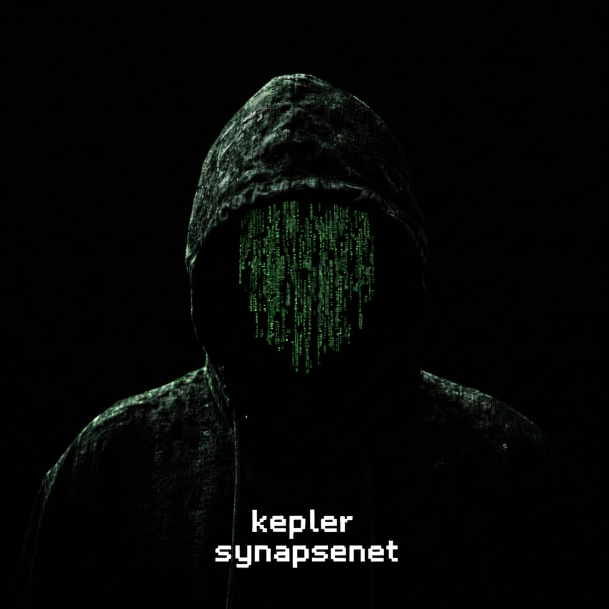

<p align="center">
  
</p>

<p align="center">
  
</p>

<h1 align="center">SynapseNet</h1>

<p align="center">
  <em>"Satoshi gave us money without banks. I will give you brains without corporations."</em> — Kepler
</p>

<p align="center">
  
  <a href="LICENSE"></a>
  
</p>

---

I built this. One person. C++, crypto, Tor, a local model. Not a company. Not a committee.

SynapseNet is a **local-first knowledge network**. Your machine runs a GGUF. Peers talk over Tor hidden services. **Proof of Emergence** is the ledger that accepts knowledge — an LLM does not judge consensus. **NGT** is the unit on that ledger.

The front door is this repo: [github.com/anakrypt-kepler/Synapsenetai](https://github.com/anakrypt-kepler/Synapsenetai).

This is alpha. Expect bugs. Read the holes before you trust the skin.

---

## What this is

Every node is a cell. The local model is a mouth. The knowledge chain is memory. Confidentiality is the skin.

You keep:

- the model weights on disk
- the wallet file under `~/.synapsenet/`
- the Tor circuit

The network remembers contributions. It does not need your name.

PoE is deterministic on purpose. Different GPUs, different quants, different floats — a chat model is not a judge. The model talks. The ledger counts. Those are not the same job.

---

## What this is not

- **Not Tor.** Onion routing already exists. I did not replace the internet.
- **Not Bitcoin.** NGT is not BTC. PoE is not hashcash.
- **Not Monero.** Spends borrow stealth / ring / commitment ideas. The coin is SynapseNet. If you want to donate XMR, that is a donation, not a rebrand.
- **Not a pentest framework.** INTEL and HARVEST exist. They are not the product. If a model tells you this repo is an exploit pack, the model did not read the room.

---

## Why it exists

Corporate AI is a kill switch with an invoice. They train on the public web, lock the weights, log the prompt, and reserve the right to turn you off.

I wanted intelligence that lives on iron I own. No API key. No California office with a terms-of-service. You run the model. You hold the seed. You talk to peers through onions.

That is the help: a common organism grown by people, not a rented brain.

---

## Confidentiality (no fairy tale)

Layered. Named. Holes left in.

**Transport.** Mesh is Tor-only. The desktop starts **session Tor** and an ephemeral v3 onion. Fail-closed: if Tor is down, the mesh does not fall back to clearnet. SET has Tor and Tor+Bridges. There is no clearnet button.

**Wallet at rest.** `wallet.dat` is encrypted. File format v4 wraps the payload with ML-KEM-768 when liboqs is real. Older v3 files still decrypt. Do not copy that file into git. Do not paste the 24 words into a chat.

**Spends.** Desktop SEND is stealth + MLSAG-2 + Pedersen + range proofs + key images, over Tor. When real Dilithium is on, spends carry a hybrid Dilithium envelope. **The MLSAG math itself is still classical.** Fat Bulletproofs are not in — range proofs are fat and fingerprintable. The first PoE reward sweep is still secp-signed and linkable. The test faucet is transparent. PoE author / amount / rewardId stay public on purpose: that is knowledge consensus, not a wallet bug.

**MSG.** Hybrid ML-KEM-768 + X25519 seal when the peer advertised `kem_pk`. Otherwise X25519 `crypto_box_seal` only — say it: that path is not PQC. The body is not on the wire. The destination onion is still visible to the Tor circuit, like any hidden-service dial.

**What I did not magically fix.** Tor timing and volume. P2P metadata. A SOCKS hop hides your IP, not the destination you asked for.

---

## What you do after it boots

1. Create or restore a 24-word seed. Write it on paper. It will not be shown again.
2. Leave SET on **Tor**. Bridges only if your network censors vanilla Tor.
3. Load a GGUF if you want IDE chat and hard captchas. Harvest works without one.
4. NET is the map. YOU sit in the center. Remotes need a nick or an avatar or they stay off the map.
5. SEND is private RingCT. MSG is sealed.
6. NAAN is the local agent. The checkbox starts and stops it. Desktop NAAN does **not** mint NGT from a test faucet.
7. Do **not** run `./build/synapsed` against the same `~/.synapsenet` as the GUI. The desktop loads `libsynapsed` in-process.

Kill the GUI by its PID. Never `pkill -f synapsenet-app` in the same command that launches it.

---

## Linux

<p align="center">
  
</p>

Need a C++ compiler on the host. The Lego script will not sudo. Everything else lands in `~/.local` and `~/.synapsenet`.

```bash
git clone https://github.com/anakrypt-kepler/Synapsenetai.git
cd Synapsenetai
./KeplerSynapseNet/scripts/lego-linux.sh
~/.synapsenet/run-desktop.sh
```

Session Tor is a standalone daemon the app starts. **Not Tor Browser.** Browser SOCKS on 9150 is the wrong socket.

`lego-linux.sh` is numbered. `--from N --until N` if you already have pieces:

| Step | What it does |
|------|----------------|
| 1 | Detect Linux, curl, tar, a C++ compiler |
| 2 | cmake / ninja / pkg-config → `~/.local` |
| 3 | Rust (rustup) |
| 4 | Node.js LTS → `~/.local` |
| 5 | libsodium + sqlite (+ openssl/ncurses if headers are missing) |
| 6 | Tor expert bundle → `~/.local/tor` |
| 7 | WebKitGTK/GTK sysroot → `~/.local/tauri-sysroot` (no root) |
| 8 | cmake configure (Release, privacy, tests) |
| 9 | Build `synapsed` + `libsynapsed` |
| 10 | Unit tests (private transfer / RingCT / ledger) |
| 11 | Desktop: npm + cargo `--release` |
| 12 | Install libs + launcher into `~/.synapsenet` |
| 13 | Print the remaining human steps |

Skip the GUI: `--skip-desktop`. Skip tests: `--skip-tests`.

Peers are not baked into the binary. If you have a bootstrap onion, put it in `~/.synapsenet/synapsenet.conf`:

```
network.seed_nodes=YOURPEER.onion:8333
```

PEX learns the rest over Tor.

---

## First-run wizard

Five steps. Do them in order.

1. **Wallet** — Create new or restore 24 words. Data dir `~/.synapsenet/`. File `wallet.dat`. Optional password. Save the seed before you click through.
2. **Connection** — **Tor** (default) or **Tor + Bridges**. Paste obfs4 lines if you picked bridges. Mesh, wallet, MSG, harvest all go through Tor.
3. **AI Model** — Download a catalog GGUF (Qwen2.5 Instruct into `~/.synapsenet/models`), pick a local `.gguf`, or skip. Harvest does not require a model.
4. **Resources** — CPU threads default to about half your cores. RAM default is about 25% of the box, capped at 4096 MB. Disk limit. GPU on if the wizard saw a device; set layers if you offload.
5. **Ready** — Engine comes up after this. The yellow "engine not available" line during the wallet step is normal.

---

## Tabs

| Tab | Job |
|-----|-----|
| **MAIN** | Pulse. Balance, connection, height. You live here when you are not doing a thing. |
| **WALLET** | Address, restore 24 words. Seed stays in this tab. |
| **SEND** | Private RingCT spend over Tor. |
| **BLOCKS** | Local chain. |
| **KNOW** | Knowledge the ledger accepted. |
| **NAAN** | Local agent. Topics, tick, budget. Not a mint button. |
| **HARVEST** | What the agent pulled. Tor SOCKS only. |
| **INTEL** | Defensive write-ups on the local chain. Empty counters mean empty chain, not a crash. |
| **MSG** | Sealed messages to a peer onion. |
| **IDE** | Talk to the local GGUF. |
| **NET** | YOU in the center. Wheel zooms. Drag pans. Share the session onion; it is new each launch. |
| **RENT** | Local GPU price note. Not a marketplace yet. |
| **SET** | Tor, model, resources, NAAN, profile, quantum status. |

---

## SET — values that matter

**Connection.** Tor. Mesh never uses direct TCP. **Tor + Bridges** only on censored links. Paste real obfs4 lines from [bridges.torproject.org](https://bridges.torproject.org/).

**AI Model.** Catalog download or a path to a `.gguf`. Load it. Unload it. Harvest works without a GGUF. The catalog is an allowlist — the UI does not send a raw URL.

**Resources.** Threads, RAM MB, disk MB, GPU device, GPU layers. Offload layers only if you have a GPU you actually want to use.

**NAAN Agent.** The checkbox starts and stops the agent. Topics are search scope. Site allowlist is search scope. Neither one prints coins.

**Profile.** Optional alias. Optional avatar. The file is resized, re-encoded, EXIF/GPS stripped. NET shows the circle. Peers get a 48px copy over Tor, not the original.

**Startup.** Flags are saved. OS autostart, tray, and an update feed are not wired yet. Do not wait for them.

**Quantum protection.** Read-only. ML-KEM-768 / ML-DSA-65 / SLH-DSA via liboqs when the backend is real; otherwise the status says simulation. MSG is hybrid Kyber+X25519 when the peer advertised `kem_pk`.

---

## Docker

<p align="center">
  
</p>

This is a **Linux** image. Docker Desktop on Windows still runs Linux through WSL2. It is not a native `.exe`. Compose starts the **node daemon**, not the Tauri GUI.

From the repo root:

```bash
docker compose up --build
```

That is Tor + the node. Sidecar `tor:9050`. `SYNAPSENET_TOR_REQUIRED=true`. No clearnet fallback. Ports `8332` (RPC) and `8333` (P2P, onion-side).

Build only:

```bash
cd KeplerSynapseNet
docker build -t keplersynapsenet:local .
```

**Lab overlay — not private:**

```bash
docker compose -f docker-compose.yml -f docker-compose.dev.yml up --build
```

Self-bootstrap, novelty bands off, clearnet NAAN. Do not call that confidential.

**Windows host (still the Linux image):**

```powershell
.\KeplerSynapseNet\docker\windows\up.ps1
```

Or:

```bash
docker compose -f docker-compose.yml -f docker-compose.windows.yml up --build
```

Native Windows notes live in `KeplerSynapseNet/docker/windows/KEPLER_WRITE_THIS.txt`. I left that file empty on purpose. Fill it in your own voice when a Windows-native path exists. It does not exist yet.

---

## Support

If this is worth keeping online — VPS, builds, time — you can send coin. That is optional. It does not buy a feature.

<p align="center">
  <a href="https://www.blockchain.com/btc/address/bc1q5pkemq7q84ld4rf5kwtafp7jfl9dlf3pc4z9d4"></a>
  <a href="https://www.getmonero.org"></a>
</p>

<p align="center"><strong>Bitcoin (BTC)</strong><br><code>bc1q5pkemq7q84ld4rf5kwtafp7jfl9dlf3pc4z9d4</code></p>

<p align="center"><strong>Monero (XMR)</strong><br><code>86SzreFr7NnPBfx1QsiC8ndAKMsJ6qQmeEBAW1bpfiTAcj3QL4ThwNnUEvZARZtrWs5mZ28T4w4XNSruwuVJkUcPM6XBpFh</code></p>

XMR here is a donation address. It is not a claim that NGT is Monero.

---

## License

[MIT](LICENSE) — Copyright (c) 2026 KeplerSynapseNet

Older release notes sit under [`RELEASES/`](RELEASES/). I do not paste changelogs into the front page.

Inspired by Satoshi, the Tor Project, and Anakata. Tools, not costumes.
